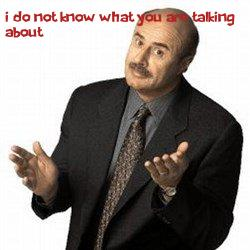

# MEME-GENERATOR

This repository contains code that builds a neural network to generate humorous captions on the provided images.

Collected data from online sources using a web-scraping script.

Used PyTorch in building the model framework, with Beam-search for drawing out predictions. 

We also incorporated the Attention mechanism in one of the model's framework and observed its effects. 

## Captioned Samples
<table>
    <tr>
        <td></td>
        <td></td>
        <td></td>
    <tr>
        <td></td>
        <td></td>
        <td></td>
<table>

## Dependencies
---
    
    - Python ----------------- 3.8.2
    - Numpy ------------------ 1.21.4
    - PyTorch ---------------- 1.8.1+
    - Torchvision ------------ 0.9.1+
    - Matplotlib ------------- 3.3.0
    - PIL -------------------- 7.1.2
    - cv2 -------------------- 4.6.0
    - tqdm ------------------- 4.46.1

## Generating Memes
---
1. Clone the repository to maintain directory structure

    `git clone https://github.com/tiva-OG/meme-generator.git`

2. Move to the cloned repository, on the parent directory, run the command

    `python caption.py --img_path "path\to\your\own\image.jpg"`

    This command by default displays a captioned image to the screen and saves another to the `save_path` folder. This `save_path` can be changed using the `--save_path` flag on the command-line

There are many other arguments that can be altered written out in `args.py`

## Challenges
---

* **Captions contain "\<unk>" keyword:**

    Words that don't occur to frequently were replaced with the "\<unk>" keyword, and this may appear when the model is making predictions. A good solution to this is to make the vocabulary more robust.
* **Model perform slightly worse with the attention mechanism:**
    
    It happened that predictions from the model trained with Attention wasn't so impressive :disappointed:. Increasing the amount of training data may handle this issue.

## TODO
---
✅ Incorporate Attention-mechanism into model framework

⬜ Increase data to make model and the vocabulary more robust

⬜ Some features I can't come up with rn :expressionless:

## References
---
- [Show, Attend, and Tell](https://arxiv.org/pdf/1502.03044 "Show, Attend, and Tell"): Neural Image Caption Generation with Visual Attention
- [a-PyTorch-Tutorial-to-Image-Captioning](https://github.com/sgrvinod/a-PyTorch-Tutorial-to-Image-Captioning "a-PyTorch-Tutorial-to-Image-Captioning")
- [Stanford CS224N NLP with Deep Learning ](https://youtu.be/ptuGllU5SQQ "Stanford CS224N NLP with Deep Learning | Lecture 9 - Self-Attention and Transformers")| Lecture 9 - Self-Attention and Transformers

